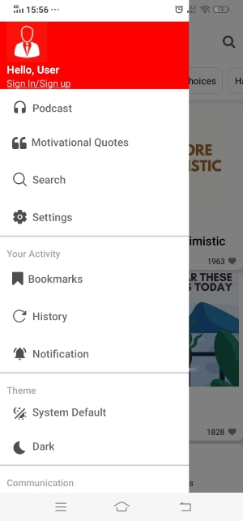
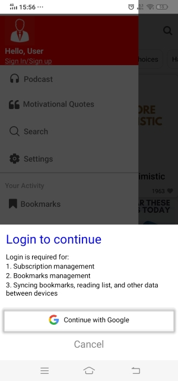
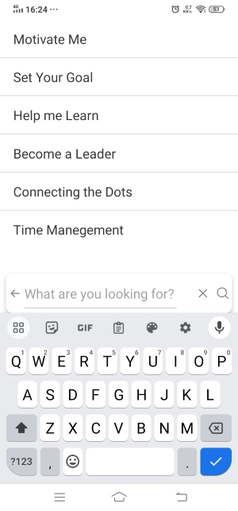
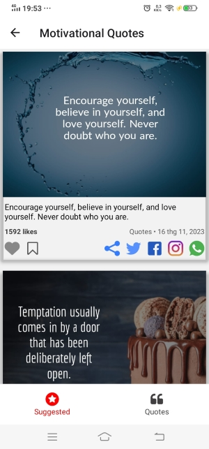

# MakeMeBetter App
- Với Make Me Better, người dùng được trải nghiệm kho nội dung phong phú xoay quanh những câu chuyện thành công, mẹo vặt cuộc sống… để giúp bạn ngày càng trở nên tốt hơn và đạt đến mục tiêu theo cách hiệu quả nhất có thể.Tất cả các bài viết, câu chuyện đổi đời đều được viết dưới dạng ngắn gọn, tóm tắt, dễ nhớ và thiết thực trong cuộc sống.
- Ứng dụng này cũng đi kèm với một thư viện podcast ngày càng tăng về các bài học cuộc sống và chủ đề tự lực khác nhau. Nghe và xem chúng mọi lúc, mọi nơi khi đang di chuyển. Nội dung trực quan hấp dẫn hơn, điều này sẽ nâng cao khả năng học tập của bạn. 

# Trang chủ:
- Trang Articles (bài viết):
Bài viết được lọc theo các chủ đề khác nhau: suggested, lifesstyle choices, habit building, introspection, motivational, career, communication skills, goal setting, relationships

- Trang Feeds (tổng hợp những câu trích dẫn hay được cập nhật liên lục)
Các lời trích dẫn được lọc theo các chủ đề khác nhau như: quotes, affirmations, health tip, finance tips.

# Profile

# Log in

# Log out

# Podcast

# Search

# Search item:

# Chi tiết bài viết (Article)

# Settings

# Set Font

# Motivational Quotes

# Bookmarks

# History

# Notifications

